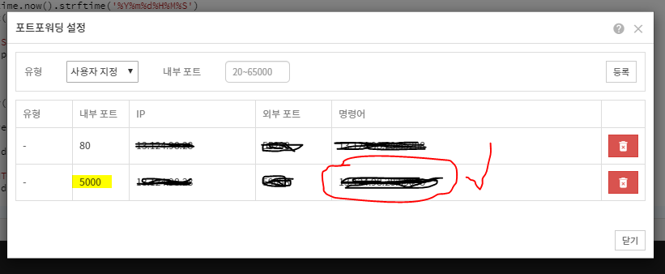

# Flask를 이용해 API를 만들어보자

공식 document를 참고하자.
[Flask Quickstart](http://flask.pocoo.org/docs/1.0/quickstart/)

준비물
- 클라우드 통합개발환경 Goorm IDE
  https://accounts.goorm.io/


1
작업폴더는 /workspace다. 해당 폴더로 이동
```
root@goorm:/workspace#  
```

2
소스파일을 git clone해준다.
```
root@goorm:/workspace# git clone ~
```

3
clone받은 폴더로 들어가서 다음 명령어 입력
```
root@goorm:/workspace/Tutorial1(develop)# export FLASK_ENV=hello
root@goorm:/workspace/Tutorial1(develop)# flask run --host=0.0.0.0
```

개발모드로 실행하려면
```
root@goorm:/workspace/Tutorial1(develop)# export FLASK_ENV=development
root@goorm:/workspace/Tutorial1(develop)# flask run --host=0.0.0.0
```
=> 변경사항이 발생했을 떄 저장하면 알아서 다시시작해줌


4
포트포워딩해주자
(위 실행화면에 보면 포트가 5000번이니까 5000번을 열어준다)


5
이제 명령어 부분에 있는 주소를 브라우저에 입력
다음화면이 뜨면 됨

